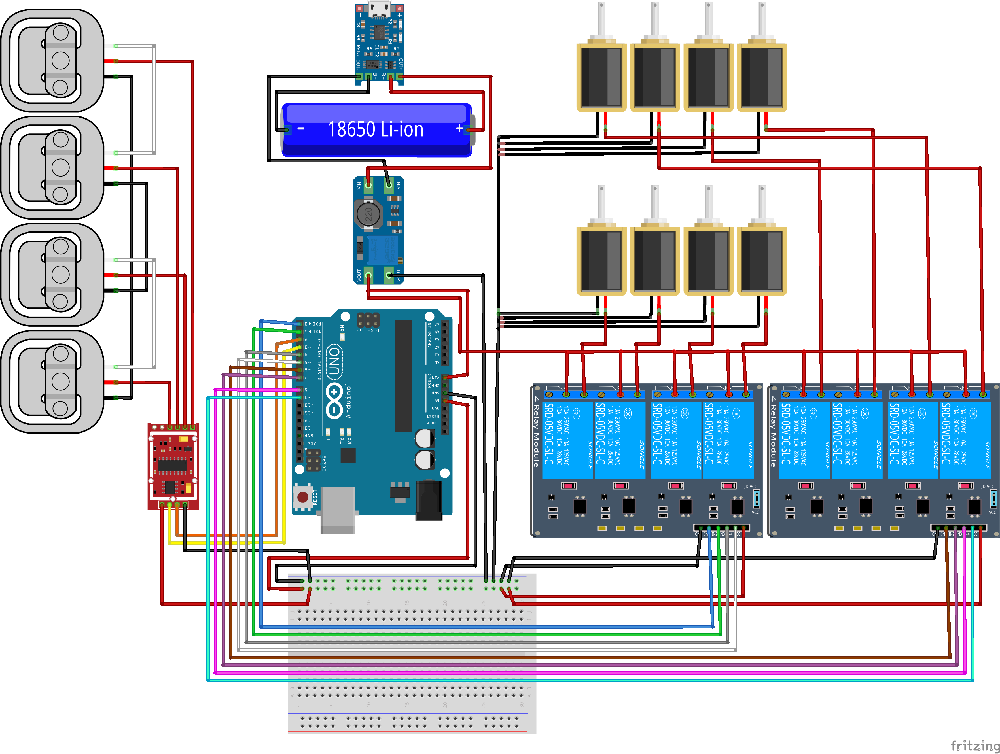

# BLIND_X
Blind-X is a team dedicated to building a better society through creative technology.

---
## How to install

# download source code
```bash
git clone https://github.com/robot-is-my-life/BLIND_X.git
```
# how to start
아두이노 IDE를 사용하여 BLIND_X/src_mcu/vibe_2_motor_loadcell.ino 파일을 Arduino 보드(Uno,Mega 호환가능)에 업로드하여 사용 
아래의 2가지 단계로 순차적으로 실행
1. 무게 측정 단계
2. 진동 패턴 출력 단계
3. 다시 대기상태 돌입

# calibration
정확한 무게 측정을 위해 calibration 해주는 과정이 필요함.

 1. BLIND_X/src_mcu/digital_scale.ino 파일의 ISCALIB를 변수를 0에서 1로 변경
 2. HX711 로부터 읽은 값과 실제 값을 BLIND_X/calibration_tools/roadcell_lookup_table.xlsx 에 기록 (X: 측정값, Y:실제 중량)
 3. calibration.py 실행하여 curve fitting (3차 다항식) 계수획득 
```bash
./BLIND_X/calibration_tools/calibration.py
```
 4. BLIND_X/src_mcu/digital_scale.ino 의  calibrate_scale 함수 내 3차 다항식 계수에 측정한 계수 입력

---

# BLIND_X - VibroScale(진동 체중계)


---

# BLIND_X - TouchScale(점자패드 체중계)

